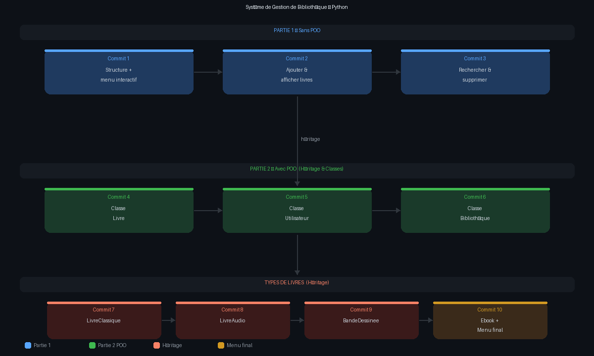

# 📚 Système de Gestion de Bibliothèque — Python

> Projet Python réalisé dans le cadre d'un exercice pédagogique.  
> Il couvre les bases du langage ainsi que la Programmation Orientée Objet (POO).

---

## 🗺️ Roadmap du projet



---

## 🎯 Objectif

Développer une application en ligne de commande permettant de gérer une bibliothèque,
en deux versions progressives :

- **Partie 1** — Version simple sans POO
- **Partie 2** — Version orientée objet avec héritage

---

## 🗂️ Structure du projet

```
bibliotheque-python/
├── main.py          # Partie 1 — menu sans POO
├── main_poo.py      # Partie 2 — menu avec POO
├── models.py        # Classes : Livre, Utilisateur, Bibliotheque + types
└── README.md
```

---

## ⚙️ Fonctionnalités

### Partie 1 — `main.py` (sans POO)

| Fonctionnalité | Description |
|---|---|
| Ajouter un livre | Saisie titre + auteur, stocké dans une liste de dictionnaires |
| Afficher les livres | Affichage numéroté de tous les livres |
| Rechercher un livre | Recherche insensible à la casse dans titre et auteur |
| Supprimer un livre | Suppression par numéro dans la liste |
| Menu interactif | Boucle `while` avec choix utilisateur |

### Partie 2 — `main_poo.py` + `models.py` (avec POO)

| Fonctionnalité | Description |
|---|---|
| Ajouter un livre | Choix du type + création d'un objet |
| Afficher les livres | `bib.afficher()` — appelle `__str__` de chaque livre |
| Rechercher un livre | `bib.rechercher(terme)` — filtre par titre ou auteur |
| Supprimer un livre | `bib.supprimer(id)` — suppression par ID unique |
| Emprunter un livre | `user.emprunter(livre)` — vérifie la disponibilité |
| Retourner un livre | `user.retourner(livre)` — remet le livre disponible |

---

## 🏗️ Architecture POO

### Classe `Livre` — la base

```python
class Livre:
    def __init__(self, titre, auteur)
    def emprunter()       # passe disponible à False
    def retourner()       # passe disponible à True
    def __str__()         # représentation textuelle
```

### Classe `Utilisateur`

```python
class Utilisateur:
    def __init__(self, nom)
    def emprunter(livre)  # vérifie dispo → délègue à Livre
    def retourner(livre)  # vérifie emprunt → délègue à Livre
```

### Classe `Bibliotheque`

```python
class Bibliotheque:
    def __init__(self, nom)
    def ajouter(livre)
    def supprimer(livre_id)
    def rechercher(terme)
    def afficher()
```

### Héritage — Types de livres

```
           Livre  (classe parent)
          /   |   \    \
         /    |    \    \
LivreClassique  LivreAudio  BandeDessinee  Ebook
  + siecle      + duree      + nb_planches  + format
```

Chaque sous-classe hérite de `Livre` via `super().__init__()` et ajoute son propre attribut.

---

## 🚀 Lancer le projet

### Prérequis

- Python 3.10 ou supérieur

### Partie 1

```bash
python3 main.py
```

### Partie 2

```bash
python3 main_poo.py
```

---

## 📝 Concepts Python pratiqués

| Concept | Où |
|---|---|
| Variables & types | Partout |
| Listes & dictionnaires | `main.py` |
| Structures de contrôle `if/while/for` | Partout |
| Fonctions | `main.py` |
| Classes & objets | `models.py` |
| `__init__`, `__str__` | `models.py` |
| Héritage & `super()` | Types de livres |
| List comprehension | `rechercher()` |
| Gestion d'erreurs `try/except` | `main_poo.py` |

---

## 📋 Historique des commits

| Commit | Description |
|---|---|
| `Commit 1` | Structure du projet + menu interactif |
| `Commit 2` | Ajouter et afficher des livres |
| `Commit 3` | Rechercher et supprimer un livre |
| `Commit 4` | POO — classe `Livre` |
| `Commit 5` | POO — classe `Utilisateur` |
| `Commit 6` | POO — classe `Bibliotheque` |
| `Commit 7` | Héritage — `LivreClassique` & `LivreAudio` |
| `Commit 8` | Héritage — `BandeDessinee` |
| `Commit 9` | Héritage — `Ebook` |
| `Commit 10` | Menu POO final complet |

---

## 👤 Auteur

**Abraham** — étudiant en développement Python  
Dépôt : [github.com/ASapAbro/Python_Gestion_biblioth-que_](https://github.com/ASapAbro/Python_Gestion_biblioth-que_)
